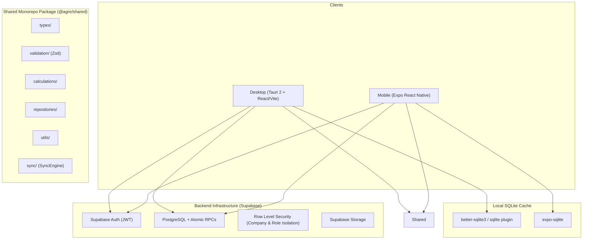

# Agre Billing — Architecture Documentation

## 1. System Overview

Agre Billing is an independent, offline-first billing and accounting system engineered specifically for retail and wholesale shop operations. It is designed around the workflow principles of **TallyPrime 7.1** (gateway navigation, double-entry vouchers, keyboard-first velocity, compact information-dense tables), with an Agre-branded modern desktop application (Tauri 2 + React) and a mobile point-of-sale app (Expo React Native).

## 2. Core Architectural Pillars

### A. Unified Voucher Model
Rather than having disjointed tables for sales, purchases, and payments, all financial transactions are unified under the `vouchers` model with associated line items (`voucher_items`), double-entry ledger postings (`voucher_ledger_entries`), and inventory tracking (`stock_movements`).

### B. Double-Entry Accounting Foundation
Every confirmed transaction automatically posts balanced debit and credit entries. Sales debit Cash/Bank or Customer Receivables and credit the Sales Account. Payments debit Payables and credit Cash/Bank.

### C. Strict Tax-Free & Barcode-Free Domain
- **No GST / Tax Calculations**: All calculations follow `Quantity × Rate − Discount = Amount`.
- **No Barcode dependency**: Fast textual search across Name, SKU, and Category.

### D. Safe Concurrency & Invoice Numbering
- Server allocation uses PostgreSQL sequences locked via `SELECT ... FOR UPDATE` inside `next_voucher_number()`.
- Offline clients generate prefix-based draft numbers (`{device_id}-{sequence}`) which are mapped to canonical numbers upon sync, eliminating duplicates or sequence gaps.

### E. Transaction Atomicity
All mission-critical writes execute inside database transactions via stored RPCs (`create_sale`, `create_purchase`, `create_receipt`, `create_payment`, `create_expense`, `cancel_voucher`), preventing half-written state.
