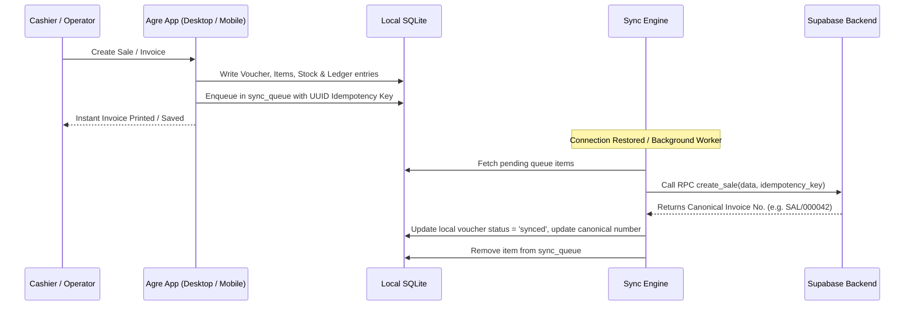

# Agre Billing — Sync Engine & Offline Architecture

## 1. Synchronization Architecture

Agre Billing implements an **offline-first** design for uninterrupted shop billing during network outages.

## 2. Idempotency & Conflict Resolution

- **Unique Idempotency Key**: Every transaction generated on any device is assigned a UUID v4. The server enforces a `UNIQUE(idempotency_key)` constraint. Retrying network requests will return the existing record without duplicating accounting or stock movements.
- **Delta Sync**: All tables track `updated_at`. When syncing master data (products, prices, customer details), the client queries `updated_at > last_synced_at`.
- **Server Authority**: Server-side timestamp resolution handles concurrent master-data edits.
